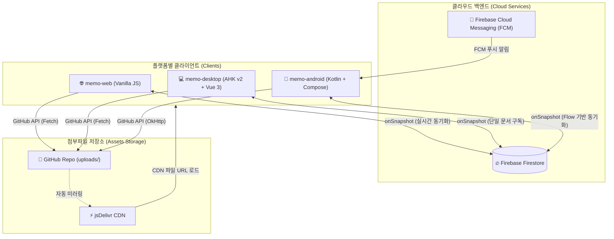

# 📝 메모 모노레포 (Memo Monorepo)

이 저장소는 기존 `somyun/memo` GitHub 프로젝트의 자산을 보존하면서, 동일한 Firebase Firestore 백엔드를 공유하는 **웹(Web), 안드로이드(Android), 데스크톱(Desktop) 클라이언트**를 하나의 모노레포로 통합하여 관리하는 프로젝트입니다.

---

## 🏗️ 전체 아키텍처 및 데이터 흐름

모든 클라이언트는 단일 Firebase Firestore 데이터베이스를 공유하며 실시간으로 양방향 동기화됩니다. 이미지 및 파일 첨부는 서버 비용을 최소화하기 위해 **GitHub REST API**를 통해 본 저장소의 `uploads/` 폴더에 직접 업로드되며, 전 세계 사용자에게 빠른 속도로 제공하기 위해 **jsDelivr CDN**을 통해 렌더링됩니다.



---

## 🗂️ 프로젝트 폴더 구조

```
.
├── .github/
│   └── workflows/
│       └── deploy-pages.yml     # GitHub Pages 정적 웹 자동 배포 CI/CD
├── memo-web/                    # 1. 정적 GitHub Pages 웹 앱 (Vanilla)
│   ├── index.html               # 메인 웹 인터페이스 및 바닐라 JS 로직
│   └── migrate.html             # 데이터 마이그레이션 툴
├── memo-desktop/                # 2. Windows 데스크톱 앱 (AHK v2 + WebView2)
│   ├── Main.ahk                 # 프로그램 진입점 및 시스템 트레이/단축키
│   ├── config.json              # 윈도우 레이어 및 개발 모드 설정
│   ├── ARCHITECTURE.md          # 데스크톱 계층 구조 상세 설계서
│   ├── lib/                     # AHK 네이티브 윈도우/브릿지 라이브러리
│   │   ├── Bridge.ahk           # JS-AHK 양방향 통신 라우터
│   │   ├── DesktopLayer.ahk     # Windows Shell 바탕화면 임베딩 레이어
│   │   ├── WebView2.ahk         # WebView2 컨트롤러 바인딩
│   │   └── WindowStateStore.ahk # 창 좌표/크기 저장소
│   └── ui/                      # WebView2 호스팅용 Vue 3 로컬 UI
│       ├── index.html           
│       ├── app.js               # Vue 3 반응형 컴포넌트 로직
│       └── bridge.js            # AHK 송수신 처리용 JS 브릿지
├── memo-android/                # 3. 모바일 안드로이드 앱 (Kotlin + Jetpack Compose)
│   ├── app/
│   │   ├── build.gradle.kts     # 의존성 및 Compose 설정
│   │   └── src/main/java/com/somyun/memo/
│   │       ├── MainActivity.kt  # Compose 메인 엔트리 액티비티
│   │       ├── ShareReceiverActivity.kt # 타 앱 공유받기 인텐트 핸들러
│   │       ├── data/            # Repository 및 GitHubUploader 로직
│   │       ├── ui/              # MemoListScreen 및 Compose 뷰모델/테마
│   │       └── widget/          # 안드로이드 홈 화면용 위젯 (전통적인 XML RemoteViews + AppWidgetProvider 기반)
└── uploads/                     # 웹/앱 공통 첨부파일 저장 공간 (GitHub API 대상)
```

---

## 💻 클라이언트 플랫폼별 세부 분석

### 1. `memo-web/` — 초경량 바닐라 JS 웹 클라이언트
* **기술 스택**: Vanilla HTML5, CSS3 (CSS Variables, Paper Texture), Pure Vanilla JS, Firebase SDK v10 (Compat)
* **주요 특징 및 핵심 로직**:
  * **Zero-Build & Zero-Dependency**: 빌드 과정 없이 `index.html` 단일 파일만으로 완벽히 동작하며, GitHub Pages에 정적 배포되므로 로딩 속도가 극도로 빠릅니다.
  * **스마트 이미지 압축**: Canvas API를 활용한 로컬 이미지 압축 로직(`compressImage`)이 내장되어 있어, **500KB가 넘는 대용량 이미지는 품질 저하를 최소화하며 JPEG로 실시간 자동 압축**하여 업로드 트래픽을 아낍니다.
  * **CDN 캐싱 지연 우회**: GitHub API로 업로드 완료 후 jsDelivr CDN 주소(`cdn.jsdelivr.net/...`)가 즉시 활성화되지 않는 미러링 딜레이(404 에러)를 해결하기 위해, 업로드 직후 화면에는 **압축된 로컬 Base64 프리뷰를 즉시 렌더링**하고 데이터는 백그라운드에서 무중단 저장됩니다.
  * **자동 저장 디바운싱**: 텍스트 입력 시 1.4초 타이머 기반의 Debounce 기법(`scheduleSave`)을 적용하여 과도한 Firestore 쓰기 API 호출을 방지하고 트래픽 비용을 절감합니다.

### 2. `memo-desktop/` — 하이브리드 데스크톱 스티커 메모
* **기술 스택**: AutoHotkey v2 (Native Win32), Microsoft WebView2 (Edge), Vue 3 (Reactive Web UI)
* **주요 특징 및 핵심 로직**:
  * **바탕화면 레이어 통합 (Desktop Active Widget)**: 윈도우의 `Progman` 및 `WorkerW` 셸 윈도우 계층을 직접 탐색하여 메모 창을 자식 창(`WS_CHILD`)으로 삽입합니다. 이를 통해 **AlwaysOnTop(항상 위)이 아닌, 바탕화면 아이콘 위에 안착하여 일반 프로그램 창 뒤에 자연스럽게 머무는 최상급 위젯 UX**를 제공합니다.
  * **AHK-JS 양방향 브리지**: `postMessage`와 JSON 프로토콜 기반의 전용 `Bridge.ahk` / `bridge.js` 모듈을 구축하여, 웹뷰 내부의 마우스 드래그 이벤트로 Win32 네이티브 창을 이동(`dragWindow`)시키거나 창 파괴(`closeWindow`)를 완벽하게 연동합니다.
  * **리소스 최적화**: 다중 창 아키텍처 환경에서 불필요한 전체 쿼리를 방지하기 위해, 개별 창마다 메모 ID 해시값을 기준으로 **단일 문서 리스너(`doc(memoId).onSnapshot`)만 바인딩**하여 메모리 및 네트워크 소모를 최소화합니다.
  * **창 상태 영속화**: 사용자가 조정한 개별 메모 창의 위치 및 크기(`x`, `y`, `w`, `h`)는 `data/windows.json` 파일에 저장되어 앱을 재시작해도 이전 레이아웃을 그대로 복원합니다.

### 3. `memo-android/` — 네이티브 모바일 애플리케이션
* **기술 스택**: Kotlin, Jetpack Compose (Declarative UI), Compose Material3, Lifecycle ViewModel Compose, OkHttp, Coil Image Loader, Firebase Firestore & Cloud Messaging (FCM)
* **주요 특징 및 핵심 로직**:
  * **Jetpack Compose 기반의 선언형 UI**: Material3 디자인 가이드를 따르며, Kotlin 코루틴 및 Flow 아키텍처 기반의 실시간 데이터 동기화를 통해 매끄러운 메모 스크롤과 전환 애니메이션을 지원합니다.
  * **`ShareReceiverActivity` (공유 연동)**: 안드로이드 OS의 글로벌 샌드 인텐트(`SEND_ACTION`)를 완벽 지원합니다. 웹 브라우저의 주소, 유튜브 링크, 이미지 파일 등을 **"메모로 공유"하는 즉시 포그라운드 UI 진입 없이 백그라운드 데이터 파싱을 거쳐 새 메모로 실시간 등록**합니다.
  * **GitHub REST API 연동**: 자바/코틀린 환경에서 멀티파트 헤더 처리가 복잡한 GitHub API 업로드를 `GitHubUploader.kt`에서 OkHttp 통신을 통해 Base64 스트림 방식으로 안정적으로 처리합니다.
  * **안정적인 XML RemoteViews 기반 위젯 (리팩토링 방향)**: 기존 Jetpack Glance API의 런타임 갱신 지연 및 오작동 한계를 극복하기 위해, **OS 검증이 완료된 전통적인 XML layout + AppWidgetProvider + RemoteViews** 방식으로 전면 전환하였습니다. 개별 위젯마다 `SharedPreferences`와 Firestore를 조율하여 오프라인/온라인 상에서 무중단 화면 갱신 및 터치 시 딥링크 상세 연동을 지원합니다.
  * **FCM 푸시 알림**: `MemoFirebaseMessagingService.kt`를 백그라운드 서비스로 구동하여 타 기기에서의 중요 변경 사항이나 알림을 실시간 원격 수신할 수 있는 인프라를 제공합니다.

---

## 🛠️ 개발 및 빌드 환경 구축 가이드

### 1. 공통 환경 설정 (Firebase & GitHub Token)
* 웹의 `index.html` 또는 앱의 환경설정 파일에 Firebase API 키 및 GitHub 개인 토큰(Personal Access Token) 설정이 필요합니다.
* 이미지/파일 업로드는 `somyun/memo` 저장소의 권한이 필요하므로 로컬 개발 시 본인 저장소 정보로 변경해야 합니다.

### 2. 플랫폼별 구동 방법

#### 🌐 Web (`memo-web`)
* 빌드 도구 없이 브라우저로 `index.html` 파일을 직접 더블 클릭하여 열거나 정적 웹 서버(VS Code Live Server, `http-server` 등)를 이용해 즉시 구동할 수 있습니다.

#### 💻 Desktop (`memo-desktop`)
1. [AutoHotkey v2](https://www.autohotkey.com/) 공식 버전을 설치합니다.
2. `lib/64bit/WebView2Loader.dll` 파일이 정상적으로 위치해 있는지 확인합니다.
3. `Main.ahk` 파일을 실행합니다.
4. **단축키**: `Ctrl + Alt + N`을 누르면 화면에 새로운 데스크톱 스티커 메모 창이 활성화됩니다.
5. 바탕화면 밀착 기능이 필요하지 않다면 `config.json`에서 `"desktopLayer": false`로 변경하여 일반 윈도우 모드로 테스트할 수 있습니다.

#### 🤖 Android (`memo-android`)
1. Android Studio (Ladybug 이상 권장)를 실행하고 `memo-android` 디렉토리를 프로젝트 루트로 엽니다.
2. `local.properties`에 적절한 SDK 경로를 지정합니다.
3. Gradle 빌드를 동기화하고 에뮬레이터 또는 실기기에서 `app` 모듈을 빌드 및 배포합니다.
