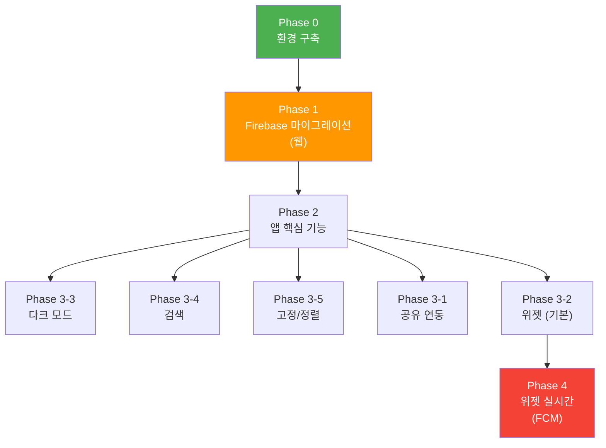

# 📱 안드로이드 메모 앱 — 전체 구현 계획서

> **프로젝트 요약**
> - 플랫폼: Android (Kotlin + Jetpack Compose) + 기존 웹 (index.html)
> - 백엔드: JSONBin.io → Firebase Firestore 마이그레이션
> - 파일/이미지 저장: GitHub (기존 유지)
> - 핵심 기능: 실시간 동기화, 위젯, 공유 연동, 다크 모드, 검색, 고정, 정렬

---

## Phase 0: 환경 구축

### Task 0-1: Android Studio 설치

> [!IMPORTANT]
> Android Studio는 약 **2GB 다운로드 + 5~8GB 디스크 공간**이 필요합니다. SDK와 에뮬레이터까지 포함하면 총 약 **15~20GB**를 확보해 주세요.

#### 1단계: 다운로드 및 설치

1. [Android Studio 공식 다운로드](https://developer.android.com/studio) 페이지에서 최신 버전 다운로드
2. 설치 프로그램 실행
3. 설치 유형: **Standard** 선택 (권장)
4. UI Theme: 원하는 테마 선택 (나중에 변경 가능)
5. SDK 컴포넌트 확인 화면에서 기본값 그대로 **Next** 클릭
6. 설치 완료까지 대기 (SDK 다운로드에 시간 소요)

#### 2단계: 첫 실행 설정

1. Android Studio 실행
2. **More Actions** → **SDK Manager** 클릭
3. **SDK Platforms** 탭에서 확인:
   - ✅ `Android 14.0 (API 34)` 이상 체크
4. **SDK Tools** 탭에서 확인:
   - ✅ `Android SDK Build-Tools`
   - ✅ `Android SDK Command-line Tools`
   - ✅ `Android Emulator`
   - ✅ `Android SDK Platform-Tools`
5. **Apply** 클릭하여 설치

#### 3단계: 에뮬레이터 생성 (실제 폰 없이 테스트용)

1. **More Actions** → **Virtual Device Manager**
2. **Create Device** 클릭
3. **Pixel 7** 또는 **Pixel 8** 선택 → **Next**
4. System Image: **API 34** 다운로드 후 선택 → **Next**
5. **Finish**

> [!TIP]
> 실제 안드로이드 폰이 있다면, USB 케이블로 연결하고 **개발자 옵션 → USB 디버깅**을 활성화하면 에뮬레이터 없이 실제 기기에서 바로 테스트할 수 있습니다. 에뮬레이터보다 훨씬 빠릅니다.
> 
> **개발자 옵션 켜는 법:** 설정 → 휴대전화 정보 → 빌드번호를 7번 연속 탭

#### 4단계: 설치 확인

Android Studio 하단 Terminal에서:
```bash
adb --version
java -version
```
두 명령 모두 버전 정보가 출력되면 정상입니다.

---

### Task 0-2: Firebase 프로젝트 설정

#### 1단계: Firebase 프로젝트 생성

1. [Firebase Console](https://console.firebase.google.com/) 접속 (Google 계정 로그인)
2. **프로젝트 추가** 클릭
3. 프로젝트 이름: `memo-app` (또는 원하는 이름)
4. Google Analytics: **사용 안 함** 선택 (불필요)
5. **프로젝트 만들기** 클릭

#### 2단계: Blaze Plan 업그레이드

1. Firebase Console 좌측 하단 → **업그레이드** 클릭
2. **Blaze (종량제)** 선택
3. 결제 수단(카드) 등록
4. 예산 알림 설정: **월 $1** (안전장치, 실제 비용은 $0 예상)

#### 3단계: Firestore Database 생성

1. 좌측 메뉴 → **Firestore Database** 클릭
2. **데이터베이스 만들기** 클릭
3. 위치: **asia-northeast3 (서울)** 선택
4. 보안 규칙: **테스트 모드에서 시작** 선택 (나중에 강화)
5. **완료**

#### 4단계: 웹 앱 등록 (index.html 용)

1. 프로젝트 설정 (⚙️) → **일반** 탭
2. **앱 추가** → **웹 `</>`** 선택
3. 앱 닉네임: `memo-web`
4. **앱 등록** 클릭
5. 표시되는 **Firebase 구성 객체(config)**를 메모해 둡니다:

```javascript
// ↓ 이 값들이 표시됩니다 (예시)
const firebaseConfig = {
  apiKey: "AIzaSy...",
  authDomain: "memo-app-xxxxx.firebaseapp.com",
  projectId: "memo-app-xxxxx",
  storageBucket: "memo-app-xxxxx.appspot.com",
  messagingSenderId: "123456789",
  appId: "1:123456789:web:abcdef"
};
```

#### 5단계: Android 앱 등록

1. 프로젝트 설정 → **앱 추가** → **Android** 선택
2. 패키지 이름: `com.somyun.memo` (또는 원하는 이름)
3. 앱 닉네임: `memo-android`
4. SHA-1 인증서: 나중에 추가 가능, 일단 건너뛰기
5. `google-services.json` 다운로드 → 나중에 Android 프로젝트에 배치

---

## Phase 1: Firebase 마이그레이션 (웹)

### Task 1-1: 기존 데이터 마이그레이션 스크립트

> JSONBin.io에 저장된 기존 메모 데이터를 Firestore로 옮기는 일회성 스크립트

```
작업 내용:
1. JSONBin.io에서 현재 데이터(memos[]) 가져오기
2. Firestore의 memos 컬렉션에 각 메모를 문서로 저장
3. 마이그레이션 완료 확인
```

**Firestore 데이터 구조:**
```
memos (컬렉션)
  ├── {memo_id} (문서)
  │   ├── text: "메모 내용..."
  │   ├── images: ["https://cdn.jsdelivr.net/..."]
  │   ├── files: [{name: "report.xlsx", url: "https://raw..."}]
  │   ├── pinned: false
  │   ├── created: Timestamp
  │   └── updated: Timestamp
  ├── {memo_id} (문서)
  │   └── ...
```

> [!NOTE]
> 기존의 `memos[]` 배열(하나의 JSONBin 문서에 모든 메모가 들어있던 구조)을 Firestore에서는 **개별 문서**로 분리합니다. 이렇게 해야 특정 메모 하나만 읽거나 수정할 때 효율적이고, 실시간 리스너도 변경된 문서에 대해서만 알려줄 수 있습니다.

### Task 1-2: index.html Firebase SDK 적용

```
작업 내용:
1. Firebase JS SDK (CDN) 추가
2. JSONBin API 호출 → Firestore SDK 호출로 교체
3. 실시간 리스너(onSnapshot) 적용 → 다른 기기에서 수정 시 자동 반영
4. JSONBin 관련 코드 제거 (JSONBIN_ID, JSONBIN_KEY 등)
5. 토큰 관리 방식 변경 (GitHub 토큰도 Firestore로 이동)
```

**변경 전후 비교:**

```diff
- const res = await fetch(`${BASE_URL}/latest`, { headers: {...} });
- const data = await res.json();
- memos = data.memos;
+ // 실시간 리스너 — 다른 기기의 변경도 즉시 반영
+ onSnapshot(collection(db, "memos"), (snapshot) => {
+   memos = snapshot.docs.map(doc => ({ id: doc.id, ...doc.data() }));
+   renderAll();
+ });
```

```diff
- // 저장: 전체 배열을 PUT
- await fetch(BASE_URL, { method: "PUT", body: JSON.stringify({memos}) });
+ // 저장: 변경된 메모 하나만 업데이트
+ await setDoc(doc(db, "memos", memo.id), memo);
```

---

## Phase 2: 안드로이드 앱 핵심

### Task 2-1: 프로젝트 생성 및 기본 구성

```
작업 내용:
1. Android Studio에서 새 프로젝트 생성
   - Template: Empty Activity (Compose)
   - Package: com.somyun.memo
   - Minimum SDK: API 26 (Android 8.0)
   - Language: Kotlin
2. google-services.json 배치
3. Gradle 의존성 추가:
   - Firebase Firestore
   - Firebase Cloud Messaging
   - Jetpack Compose Material 3
   - Coil (이미지 로딩)
   - OkHttp (GitHub API)
```

### Task 2-2: 데이터 모델 및 Repository

```
작업 내용:
1. Memo 데이터 클래스 정의
2. MemoRepository 작성 (Firestore CRUD)
3. 실시간 리스너(snapshotListener) 구현
4. ViewModel 작성 (UI 상태 관리)
```

```kotlin
// 데이터 모델
data class Memo(
    val id: String = "",
    val text: String = "",
    val images: List<String> = emptyList(),
    val files: List<FileAttachment> = emptyList(),
    val pinned: Boolean = false,
    val created: Long = System.currentTimeMillis(),
    val updated: Long = System.currentTimeMillis()
)

data class FileAttachment(
    val name: String = "",
    val url: String = ""
)
```

### Task 2-3: 메모 목록 화면 (메인)

```
작업 내용:
1. 메모 카드 컴포넌트 (텍스트 + 이미지 썸네일 + 파일 링크 + 수정일)
2. 세로 스크롤 LazyColumn으로 카드 나열
3. 상단 AppBar (검색, 정렬 버튼)
4. 하단 FAB (새 메모 추가)
5. Pull-to-refresh (당겨서 새로고침)
```

### Task 2-4: 메모 편집 화면

```
작업 내용:
1. 텍스트 편집 (TextField)
2. 이미지 첨부 (갤러리 선택 or 카메라)
3. 파일 첨부 (파일 선택기)
4. 이미지/파일 GitHub 업로드 (기존 로직 재사용)
5. 이미지/파일 삭제 (GitHub에서도 삭제)
6. 자동 저장 (debounce 1.4초)
```

### Task 2-5: GitHub 업로드 모듈

```
작업 내용:
1. GitHub REST API를 통한 파일 업로드
2. 이미지 압축 (Bitmap 리사이징, JPEG 82%)
3. 파일 삭제 (SHA 조회 → DELETE)
4. GitHub 토큰은 Firestore에서 로드
```

---

## Phase 3: 부가 기능

### Task 3-1: 공유 연동 (Share Intent)

```
작업 내용:
1. AndroidManifest.xml에 Intent Filter 등록
2. ShareReceiverActivity 작성
   - 수신된 파일/이미지 URI 추출
   - 메모 선택 다이얼로그 표시
   - 선택한 메모에 파일 첨부 → GitHub 업로드 → Firestore 업데이트
3. 다중 파일(SEND_MULTIPLE) 지원
```

**사용자 경험 흐름:**
```
탐색기에서 파일 선택 → 공유 → "메모" 앱 선택
    → 메모 목록 표시 (어떤 메모에 첨부할까요?)
    → 메모 선택
    → "파일명.xlsx 업로드 중..."
    → 완료!
```

### Task 3-2: 홈 화면 위젯

```
작업 내용:
1. Glance API를 사용한 위젯 구현
2. 위젯 추가 시 메모 선택 Configuration Activity
3. 위젯 레이아웃:
   - 상단: 메모 제목 (첫 줄)
   - 본문: 메모 텍스트 (스크롤 가능)
   - 탭 → 앱의 해당 메모로 이동
4. 최소 크기: 2×2, 리사이즈 자유
5. AppWidgetProvider로 갱신 관리
```

### Task 3-3: 다크 모드

```
작업 내용:
1. Material 3 Dynamic Color / Dark Theme 적용
2. 시스템 설정 따르기 (자동)
3. 앱 내 수동 전환 옵션 (설정 화면)
4. 메모 카드 색상 다크 모드 대응
```

| 요소 | 라이트 모드 | 다크 모드 |
|---|---|---|
| 배경 | `#ede8dd` (웹과 동일) | `#1a1a1a` |
| 메모 카드 | `#fef9c3` (노란 메모지) | `#2d2a1f` (어두운 노란색) |
| 텍스트 | `#2b2b2b` | `#e0e0e0` |
| 보조 텍스트 | `#aaa` | `#777` |

### Task 3-4: 검색 기능

```
작업 내용:
1. 상단 AppBar 검색 아이콘 → 검색 바 확장
2. 메모 텍스트 + 파일명 기준 필터링
3. 검색어 하이라이트 표시
4. 실시간 필터링 (타이핑할 때마다 즉시 반영)
```

### Task 3-5: 메모 고정 및 정렬

```
작업 내용:
1. 메모 고정(Pin):
   - 카드 길게 누르기 → 컨텍스트 메뉴 → "고정"
   - 고정된 메모는 항상 목록 최상단에 표시
   - 고정 메모에 📌 아이콘 표시
   - Firestore에 pinned: true/false 저장

2. 정렬 옵션:
   - 상단 AppBar 정렬 버튼 → 드롭다운 메뉴
   - 최신 생성순 (created ↓)
   - 오래된 생성순 (created ↑)
   - 최근 수정순 (updated ↓) ← 기본값
   - 오래된 수정순 (updated ↑)
   - 고정 메모는 모든 정렬에서 항상 최상단
   
3. 웹(index.html)에도 동일한 정렬/고정 기능 반영
```

---

## Phase 4: 위젯 실시간 갱신

### Task 4-1: FCM 설정

```
작업 내용:
1. Android 앱에 FCM 서비스 등록
2. FCM 토큰을 Firestore에 저장 (기기별)
3. 데이터 메시지 수신 시 위젯 갱신 트리거
```

### Task 4-2: Cloud Function 작성

```
작업 내용:
1. Firebase CLI 설치 (npm install -g firebase-tools)
2. Cloud Function 프로젝트 초기화
3. Firestore onWrite 트리거 작성:
   - memos 컬렉션 문서 변경 감지
   - 변경된 메모 ID를 포함한 FCM 데이터 메시지 전송
   - 해당 메모를 위젯으로 표시 중인 기기에만 전송
```

```javascript
// Cloud Function 핵심 로직 (예시)
exports.onMemoUpdate = onDocumentWritten("memos/{memoId}", async (event) => {
  const memoId = event.params.memoId;
  // 이 메모를 위젯에 표시 중인 기기의 FCM 토큰 조회
  const tokens = await getWidgetTokens(memoId);
  // 데이터 메시지 전송 → 위젯 갱신 트리거
  await sendFCMData(tokens, { action: "widget_update", memoId });
});
```

---

## 전체 일정 예상

| Phase | 내용 | 예상 소요 |
|---|---|---|
| **Phase 0** | 환경 구축 (Android Studio + Firebase) | 1일 |
| **Phase 1** | Firebase 마이그레이션 (웹) | 1~2일 |
| **Phase 2** | 안드로이드 앱 핵심 | 5~7일 |
| **Phase 3** | 부가 기능 (공유, 위젯, 다크모드, 검색, 정렬) | 4~5일 |
| **Phase 4** | 위젯 실시간 갱신 (FCM + Cloud Function) | 2~3일 |
| **총합** | | **약 2~3주** |

---

## 작업 순서 권장



> [!IMPORTANT]
> **Phase 0 → Phase 1을 먼저 완료**해야 합니다. 웹의 Firebase 마이그레이션이 완료되어야 안드로이드 앱에서 같은 Firestore를 바라보며 동기화할 수 있습니다.

---

## 🟢 다음 단계

**Phase 0부터 시작하겠습니다.** Android Studio 설치를 진행해 주시고, Firebase 프로젝트 생성이 완료되면 알려주세요. 그 다음 Phase 1 (Firebase 마이그레이션)을 바로 진행하겠습니다.
